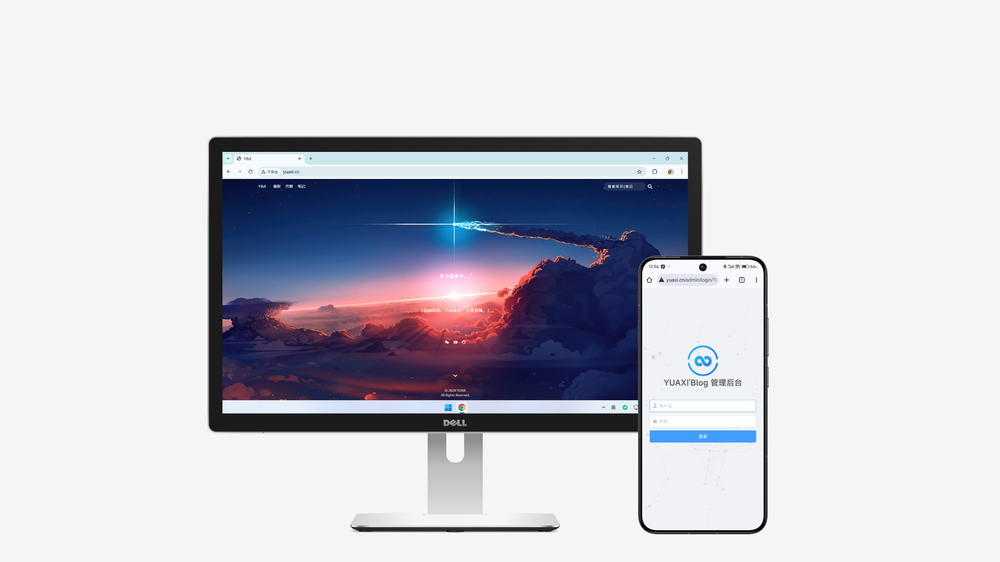

# EasyBlog

<<<<<<< HEAD
> 一个基于Django开发的简单，简洁，易管理的响应式博客站点

# 特点

1. 响应式布局适配多平台
2. 美观的django管理后台
3. 瀑布流布局
=======
> 一个基于Django开发的简单,简洁,易管理的响应式博客系统
>>>>>>> ac407f058f1b248bdcef3b9799995e2114414772

## 技术栈

前端:HTML JavaScript CSS Bootstrap Jquery

后端:Django

数据库:SQLite

